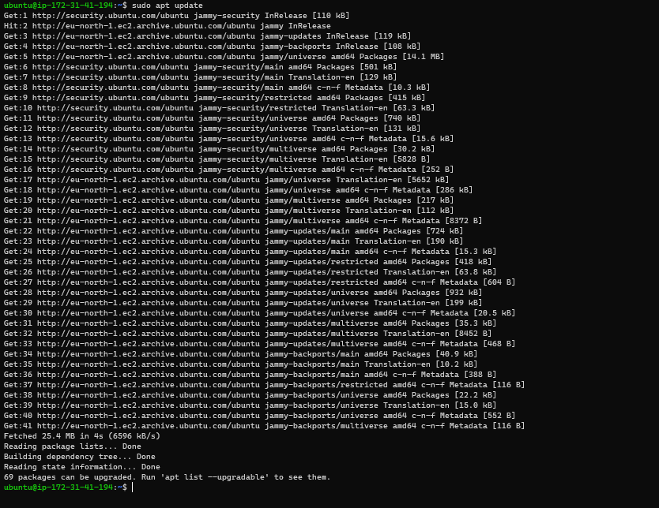
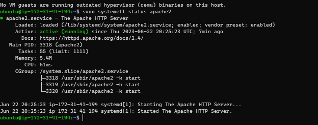
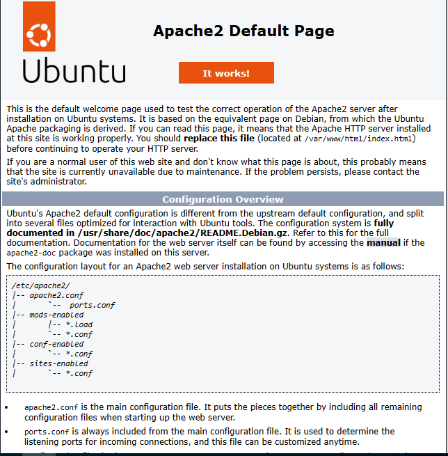

## Installation of the Apache2 web server

#update a list of packages in package manager

`sudo apt update`

#run apache2 package installation

`sudo apt install apache2`

#verify apache2 is running as a service

`sudo systemctl status apache2`

#get the public ip of the ec2 instance

`curl -s http://169.254.169.254/latest/meta-data/public-ipv4`

#test ther webserver by using the url

`http://<Public-IP-Address>:80`

